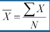
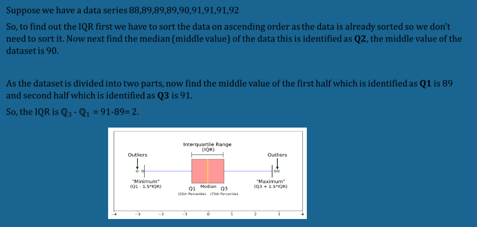
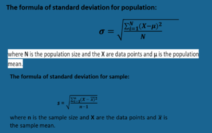
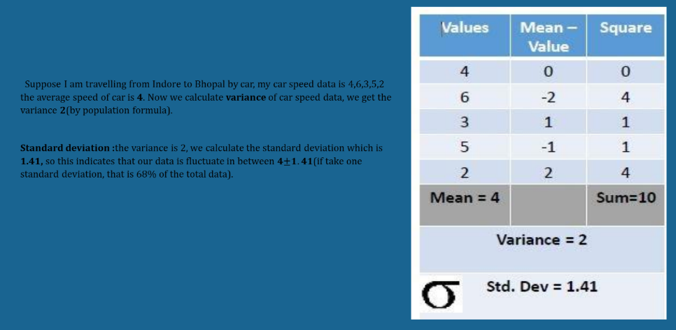
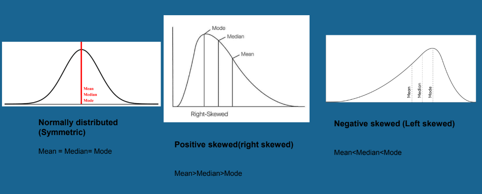
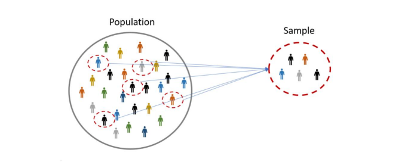
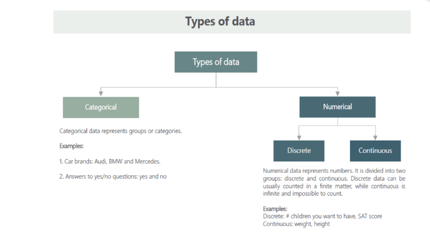

# STATISTICS

#### Introduction to Statistics

* Statistics is the science that deals with methodologies to gather, review, analyze and
draw conclusions from data.
* With specific Statistics tools in hand we can derive many key observations and make
predictions from the data in hand.
* It deals with collective informative data, interpreting those data, and drawing a
conclusion from that data.
* It is used in many disciplines like marketing, business, healthcare, telecom, etc.
 

#### Types of Statistics

Statistics is mainly of consist of two types which are as follows:-
* Descriptive Statistics
* Inferential Statistics

 

# Descriptive Statistics
▸ The type of statistics dealing with numbers (numerical facts, figures, or information)
to describe any phenomena. These numbers are descriptive statistics.
▸ e.g. Reports of industry production, cricket batting averages, government deficits,
Movie Ratings etc.
▸ It helps us to organize and summarize data using numbers and graphs to look for a
pattern in the data set.
▸ Measures of Central tendency: Mean, Median, Mode.
▸ The measure of Variability: Standard Deviation, Variance & Range

 

#### Measure of Central tendency :
Central tendency measures the center value of thedataset .It give us idea about the concentration of the value in the central part of the distribution.

1. __Mean__: It’s an average set of observation of the data. It compute the sum of all observation present in the datasets divided by total number of observation.
Steps to find the Mean/Average:
*  Add/Sum each number/observation present in the
dataset.
* Calculate the total number present in the dataset.
* Divide sum of observation to the total number of
observation.
 
Formula:
 

 

2. __Median__ : Median is the middle value of the entire dataset. Its split whole dataset in two parts and take the middle value of the datasets. It’s also called the 50th percentile.
Steps to find Median of the datasets:-
(For odd )
1. First Arrange the observation in Increasing order.
2. Divide the observation in two equal parts 50/50.
3. Take the middle value of the data.
(For even )
1. First arrange the values in increasing order.
2. Divide the observation in two equal parts 50/50.
3. Now take the middle two value of the dataset which is remain after dividing.
4. Now take the average of the middle two value, that is median of the dataset.
In case of discrete distribution the formula is:
Its obtained by considering the Cumulative frequency

N/2
In case of continuous distribution:

 

3. __Mode__ : Mode is the value which occur most frequently in the set of the observation. Data can have more than one mode as Uni-model, Bi-model,Multi model. It’s
Usage depends on the on situation as Max( ),Min( ),Mean( ).

Steps for finding the Mode:-
It’s very easy to find mode of any observation
1. Take the Most frequent value present in the dataset.
Special Cases:
1. If the maximum number of frequency repeated
2. If the maximum frequency is occur at the beginning and end of the observation.
3. If there is irregularities in the distribution.
In all the above cases we find the mode of the observation by using method of grouping.

__E.g__ : A={'A','A','B','A'}. So the mode is A because 'A' element is repeating.
 

#### Measure of Dispersion 
Measure of dispersion indicates that how the data is dispersed from the measure of central tendency.

1. __Range__ :Range is simplest measure of dispersion. It’s measure the difference between highest value and lowest value present in the dataset.It’s used to construct control chart in quality assurance.

The formula of Range is:

Range = Highest value – lowest value

Range is useful when you want to focus on extremes
values of the dataset.
 

2. __Inter-Quartile Range__  
* Inter-quartile range measure the middle 50% of the data.
* It indicate how the data is dispered around the mean.
* It's the difference between the third quartile and first quartile value of dataset.
* __IQR__ is helpful to detect the outlier present in the dataset.

Formula of __IQR__ is:
          IQR=Q3-Q1
 

__Example__:

 

3. __Variance__
* It measure the disperion of the data around the mean of data.
* It indicate how the data is dispered from the mean.
* If value of variance is closer to mean then it's a __low variance__. 
* If there is significant difference in the value from the mean then it's a __high variance__.  
* Variance is denoted by sigma square.
 

__Formulas__
 

 

4. __Standard Deviation__

* Standard Deviation is most important and frequently method in measure of disperation.
* Standard Deviation isn simply the square root of the variance.

__Formula__
 

 

__Example of Standard Deviation__
 

 

## Skewness 

It measure the distribution of the data. It indicate whether the data is distributed symmetric or not. if the data is distributed symmetric means the data is normally distributed.

__Types of Skewness__
1. Symmetric
2. Positive skewness
3. Negative Skewness
 

 

# Inferential Statistics

* Inferential statistics is a decision, estimate, prediction, or generalization about a population, based on sample.
* To make an inference or draw a conclusion from the population, sample data is used.
* Using probability to determine how confident we can be that the conclusion we make is correct.
 

### Sample and Population
* A population is the entire group that you want to draw conclusions about.
* A sample is the specific group that you will collect data from.
* The size of the sample is always less than the total size of the population.
 

 

# Types of Data
 

 

### Characteristics of Discrete Data

* Discrete data is often used in simple statistical analysis because it's easy to summarize and compute.
* Discrete data includes discrete variables that are finite, numeric, countable, and non-negative integers (5, 10, 15, and so on).
* Discrete data can be easily visualized and demonstrated using simple statistical methods such as bar charts, line charts, or pie charts.
* Discrete data can also be categorical - contain a finite number of data values, such as the gender of a person.
 

### Characteristics of Continuous Data

* Continuous data changes over time and can have different values at different time intervals.
* Continuous data is made up of random variables, which may or may not be whole numbers.
* Continuous data is measured using data analysis methods such as line graphs,skews, and so on.
* Regression analysis is one of the most common types of continuous data analysis.
 
You can see my notebook. All  the work is explained in detail.

### AUTHOR

<strong>Shehryar Gondal</strong>

You can get in touch with me on my LinkedIn Profile: 
 

You can also follow my GitHub Profile to stay updated about my latest projects: 

If you liked the repo then kindly support it by giving it a star ⭐.
